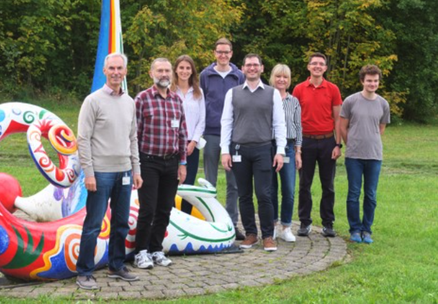

:::{#hero-heading}

The vision of our newly founded "Experimental Radiology" section is the effective utilisation of radiological imaging. The potential of image data has not yet been fully utilised, particularly with regard to precision medicine. We are therefore working on pioneering and innovative methods in the field of machine learning, deep learning and computer vision to address the special challenges in radiology and thus enable better utilisation of data. Our special focus is on pioneering techniques for reliable, robust and efficient learning, especially with little, noisy or unusually annotated data.

{width=100%}

:::
