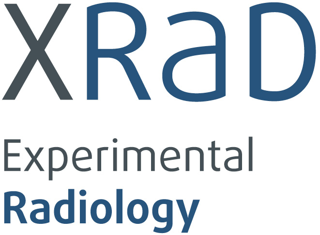

::: {.home-hero}

::: {.hero-identity}

<h1 class="hero-logo"></h1>

[Ulm University Medical Center]{.hero-institution}

::: {.hero-affiliations}
<a href="https://www.uniklinik-ulm.de/radiologie-diagnostische-und-interventionelle/schwerpunkte-sektionen/sektion-experimentelle-radiologie.html" class="affiliation affiliation-clinic" target="_blank" rel="noopener">Clinic</a>
<a href="https://www.uni-ulm.de/en/" class="affiliation affiliation-university" target="_blank" rel="noopener">University</a>
:::

:::

::: {.hero-statement}

[Research group at Ulm University Medical Center focusing on artificial intelligence (AI) in radiology.]{.hero-tagline}

We are interested in the effective utilisation of radiological image data, whose potential, particularly for precision medicine, has not yet been fully exploited. This includes developing pioneering machine learning, deep learning and computer vision methods that address the special challenges of radiology, with a focus on reliable, robust and efficient learning from little, noisy or unusually annotated data.

:::

::: {.hero-photo}
{fig-alt="XRaD group photo"}
:::

:::

::: {.home-links}
[[Research]{.home-link-label}](research.qmd)
[[Publications]{.home-link-label}](publications.qmd)
[[Team]{.home-link-label}](people.qmd)
[[Open Positions]{.home-link-label}](open_positions.qmd)
[[Contact]{.home-link-label}](contact.qmd)
:::
