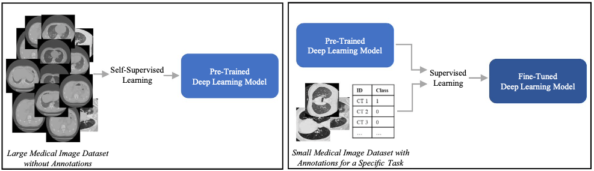
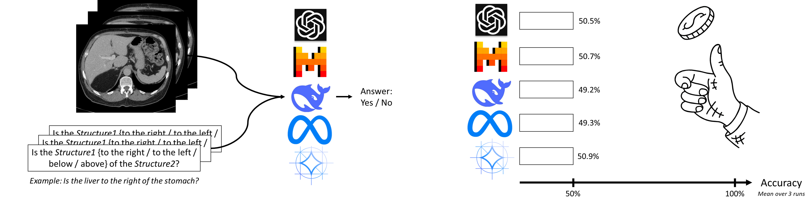

[We develop deep learning methods for medical image analysis that are interpretable, data-efficient, and robust, from vision-language and multimodal models to clinical risk prediction, bridging machine learning research with clinical practice.]{.research-intro}

::: {.grid .research-grid}

::: {.g-col-12 .research-card}
{.img-contain}

### Interpretable Medical Image Classification

[Unraveling the "black-box" behavior of modern classification models opens up the possibility of integrating them into routine diagnostics as a second-opinion system. Diagnostic criteria can be incorporated into the model architectures without compromising performance, thereby reflecting the thought process of human experts. Attribute-specific prototypes also offer the possibility of visual validation.]{.research-desc}

[Interpretable ML]{.badge} [Prototype Learning]{.badge}

[Responsible: [Luisa Gallée](mailto:luisa.gallee@uni-ulm.de)]{.research-responsible}
:::

::: {.g-col-12 .research-card}
{.img-wide}

### Self-Supervised Pretraining for Medical Image Analysis

[Expert annotations are scarce and costly, while large amounts of unlabeled medical images go unused. This project develops self-supervised pretraining methods that learn from unlabeled data, so models can be adapted to clinical tasks with only a few labeled examples.]{.research-desc}

[SSL]{.badge} [Contrastive Learning]{.badge}

[Responsible: [Daniel Santak Wolf](mailto:daniel.wolf@uni-ulm.de)]{.research-responsible}
:::

::: {.g-col-12 .research-card}
{.img-wide}

### Vision-Language Models for Medical Image Analysis

[Vision-language models link medical images with natural language, enabling tasks such as clinical question answering and report generation. This project studies how well these models understand medical images and how to make them reliable enough for clinical use.]{.research-desc}

[VLM]{.badge} [LLM]{.badge} [Foundation Model]{.badge}

[Responsible: [Daniel Santak Wolf](mailto:daniel.wolf@uni-ulm.de)]{.research-responsible}
:::

::: {.g-col-12 .research-card}
{.img-wide}

### Robust Deep Learning for Medical Image Analysis under Domain Shift and Weak Supervision

[Domain shift and limited labeled data are major obstacles to applying deep learning in medical image analysis. This project aims to improve the robustness of deep learning models under shifts such as different scanners, acquisition sites, or patient populations, using weakly supervised and unsupervised approaches.]{.research-desc}

[Domain Adaptation]{.badge} [Domain Generalisation]{.badge}

[Responsible: [Yiheng Xiong](mailto:yiheng.xiong@uni-ulm.de)]{.research-responsible}
:::

::: {.g-col-12 .research-card}
{.img-wide}

### Multimodal AI Pipeline for Postoperative Pulmonary Complication Risk

[Predicting postoperative pulmonary complications before they happen. Our model combines 12-view preoperative lung ultrasound with clinical and ARISCAT risk-factor data to estimate each patient's individual risk. The goal: give clinicians an earlier, more accurate signal to guide anesthesia planning and postoperative care.]{.research-desc}

[Lung Ultrasound]{.badge} [Multimodal Learning]{.badge} [Risk Prediction]{.badge}

[Responsible: [Sabitha Manoj](mailto:sabitha.manoj@uni-ulm.de)]{.research-responsible}
:::

:::
